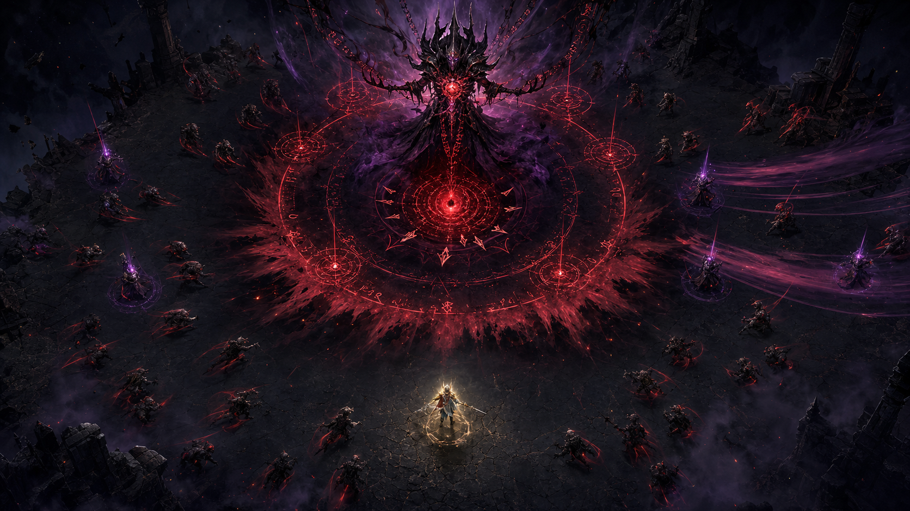

# Hi, I'm Jared Joseph 👋

Gaming Product Leader | Principal PM @ Glance (InMobi) | Ex-Krafton, Nazara  

I build products at the intersection of:

  • Games

  • AI

  • Interactive storytelling

  • Virtual commerce

Over the past decade I've led product strategy, P&L and growth for mobile and AAA games reaching millions of players worldwide.

---

## On GitHub you'll mostly find:

  • Experimental tools

  • AI prototypes

  • Gaming product experiments

  • Things I build out of curiosity

---

## 🎮 Featured Project

### NIGHTTRACE

**Draw the path. Burn the horde.**

An original browser-based horde-survival roguelite where movement itself becomes a weapon. Every step paints a luminous trace, and closing the loop burns through the approaching horde.

I designed, built, balanced, and shipped Nighttrace as an end-to-end game product experiment, spanning combat systems, progression, upgrade drafts, ten boss encounters, responsive mobile controls, offline play, and cross-device deployment.

**Built with:** `React` · `TypeScript` · `Vite` · `PixiJS` · `PWA`

### [▶ Play Nighttrace](https://jaredjos.github.io/H5-Games/nighttrace/) · [View Source](https://github.com/jaredjos/H5-Games/tree/main/games/nighttrace) · [Combat Systems Codex](https://jaredjos.github.io/H5-Games/nighttrace/docs/NIGHTTRACE_Combat_Systems_Codex.pdf)

---

---
## Outside work:
MOBA, RTS and 4X Ethusiast, anime connoisseur, and endlessly curious about the future of games and AI!
